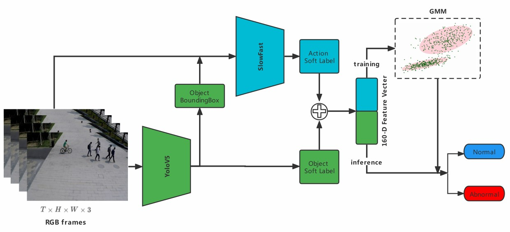

# Object and Action Anomaly Detection

## Intorduction

This is a PyToch implementation of [Object and Action Anomaly Detection Using Pretrain Models](). 

Framework:




## Contributions

- [x] we use object detection and action detection pretrain models(on coco and ava) to extrat features, which is good enough to do anomaly detection.
- [x] in training steps, we use GMM to cluster softlabel features, in inference steps, we calculate feature's probability as it's anomaly score.
- [ ] our method achieved good balance between accuracy and speed, compared with SOTA method.

| *Method Type*        | *Methods*                      | *Ped2* | *Avenue* | *SHTech* | *Speed* |
| :------------------- | ------------------------------ | :----: | :------: | :------: | :-----: |
| Image Reconstruction | Hyunjong et al. [1] (CVPR2020) |  90.2  |   82.8   |   69.8   | >67fps  |
|                      | *Ours(object label only)       |  93.1  |    /     |   70.9   |  70fps  |
| Frame Prediction     | Hyunjong et al. [1] (CVPR2020) |  97.0  |   88.5   |   70.5   |  67fps  |
| Pretrain Model       | Radu et al. [2] (CVPR 2019)    |  97.8  |   90.4   |   84.9   |  11fps  |
|                      | *Ours(object and action label) |        |          |          |  24fps  |


## Anomaly Detection Demo(SHTech dataset)


## Dataset and Model Weights Download

* USCD Ped2 [[dataset](https://github.com/StevenLiuWen/ano_pred_cvpr2018)]
* CUHK Avenue [[dataset](https://github.com/StevenLiuWen/ano_pred_cvpr2018)]
* ShanghaiTech [[dataset](https://github.com/StevenLiuWen/ano_pred_cvpr2018)]
* yolov5 [[weights file](https://github.com/ultralytics/yolov5/releases/tag/v2.0)]
* deepsort [[weights file](https://drive.google.com/drive/folders/1xhG0kRH1EX5B9_Iz8gQJb7UNnn_riXi6)]

## Installation and Usage

1. prepare environment:

   ```
   conda create -n oaad python=3.7.11
   conda activate oaad
   pip install -r requirements.txt
   git clone https://github.com/wufan-tb/oaad
   ```

2. evaluate our method with only object detection pretrain model:

   ```
   python yolo_AD.py --dataset {your dataset path}
   ```
   
3. evaluate our method with object and action detection pretrain models:

   ```
   python yolo_slowfast_AD.py --dataset {your dataset path}
   ```


## References

[1] [Hyunjong Park, Jongyoun Noh, Bumsub Ham. Learning Memory-guided Normality for Anomaly Detection. In
	Proceedings of CVPR, pages 14372–14381, 2020.](https://arxiv.org/pdf/2003.13228.pdf)

[2] [Radu Tudor Ionescu, Fahad Shahbaz Khan, Mariana-Iuliana Georgescu, Ling  Shao. Object-centric Auto-encoders and  	Dummy Anomalies for Abnormal  Event Detection in Video. In Proceedings of CVPR, pages 7842–7851, 2019.](https://arxiv.org/pdf/1812.04960.pdf)

## Citation

If you find our work useful, please cite as follow:

```
{   oaad,
    author = {Wu Fan},
    title = { Object and Action Anomaly Detection },
    year = {2021},
    url = {\url{https://github.com/wufan-tb/oaad}}
}
```
